# CorgiPile Dataset API

A high-performance, distributed dataset loading library for PyTorch with advanced shuffling algorithms and seamless scaling from single-machine to multi-machine distributed training.

## Why Choose CorgiPile?

CorgiPile Dataset API is designed for **large-scale machine learning scenarios** where traditional PyTorch DataLoader falls short. Our solution addresses critical challenges in distributed training environments.

### **Perfect For These Scenarios:**

- **Enterprise ML Training**: Large datasets (TB-scale) that don't fit in memory
- **Multi-Machine Distributed Training**: Seamless scaling from 1 to 100+ machines
- **Cloud & Cluster Environments**: HDFS, distributed storage systems
- **High-Performance Computing**: Maximize GPU utilization with efficient data loading
- **Continuous Training**: Production ML pipelines requiring robust data handling

### **Core Advantages**

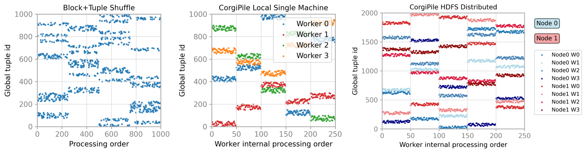
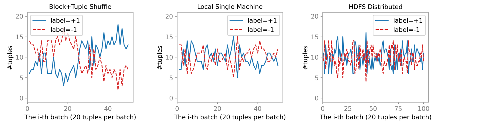

**Left: Advanced Dual-Layer Shuffle | Center: Single-Machine Parallelism | Right: Multi-Machine Distribution**

#### **1. Superior Shuffle Quality**
- **Block+Tuple dual-layer algorithm** provides optimal balance of randomness and efficiency
- Significantly better than sequential loading, comparable to full randomization
- **Memory-efficient**: No need to load entire dataset for shuffling

#### **2. Flexible Deployment Options**
- **Single-machine multi-threading**: Automatic load balancing across workers
- **Multi-machine distributed**: File-level partitioning with zero data overlap
- **Universal storage**: Local filesystem, HDFS, extensible to cloud storage

#### **3. Production-Ready Features**
- **Complete traceability**: Every sample tracked with `(file_id, inner_index)`
- **Robust error handling**: Graceful failure recovery in distributed environments
- **Performance monitoring**: Built-in logging and debugging capabilities

<details>
<summary>View All Shuffle Methods Comparison</summary>

| Method | Visualization                                                                         | Label Distribution | Description |
|--------|---------------------------------------------------------------------------------------|-------------------|-------------|
| **No Shuffle** | 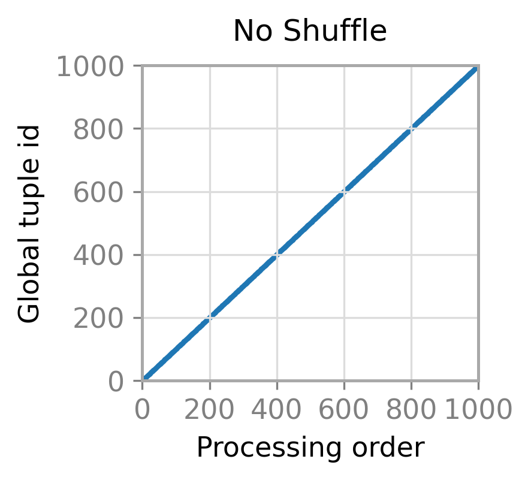                 | 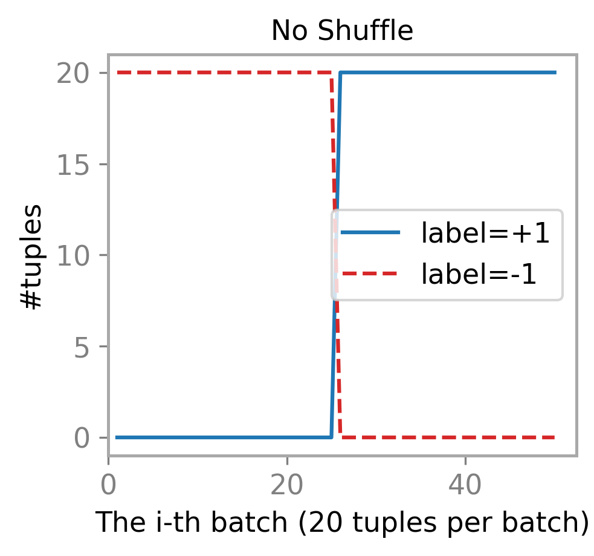 | Sequential processing - poor training quality |
| **Sliding Window** | 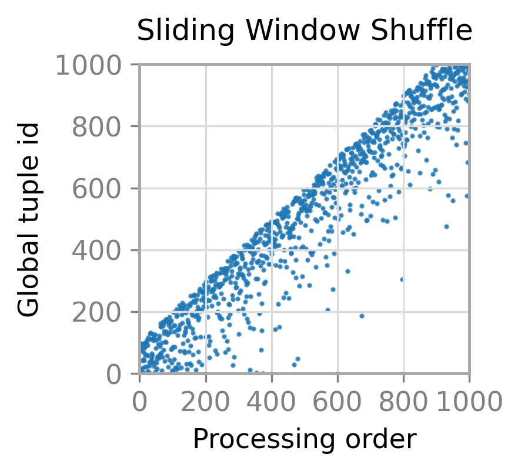 | 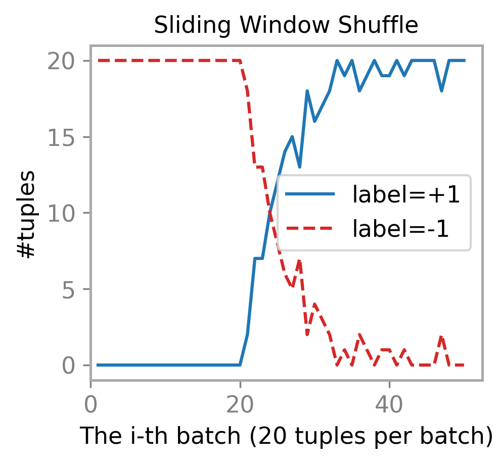 | Window-based shuffle - limited randomness |
| **MRS** | 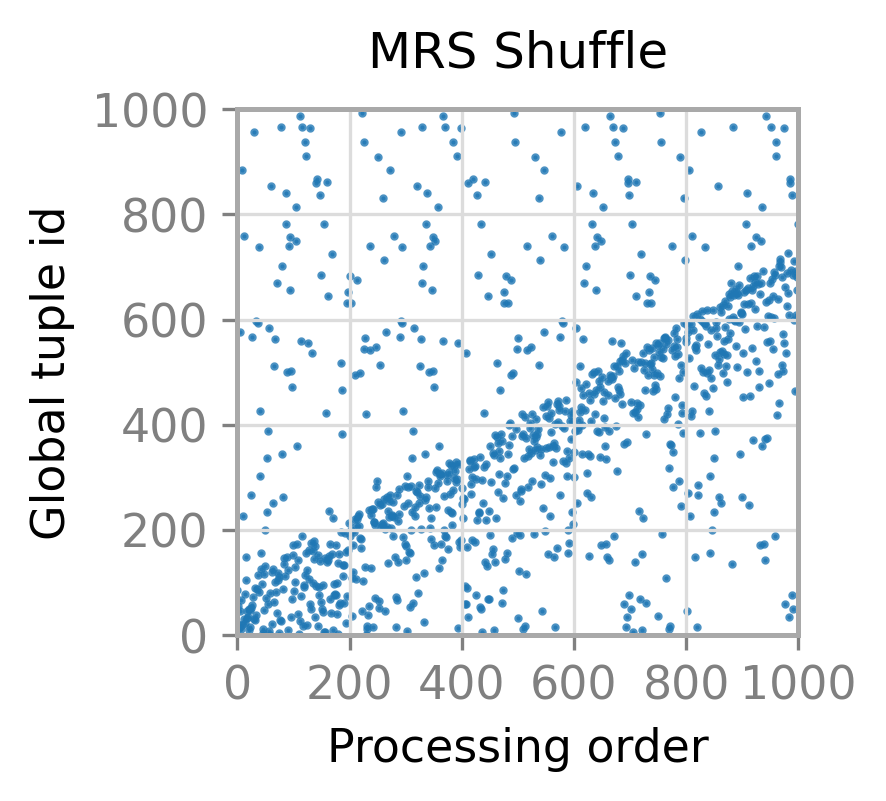                       | 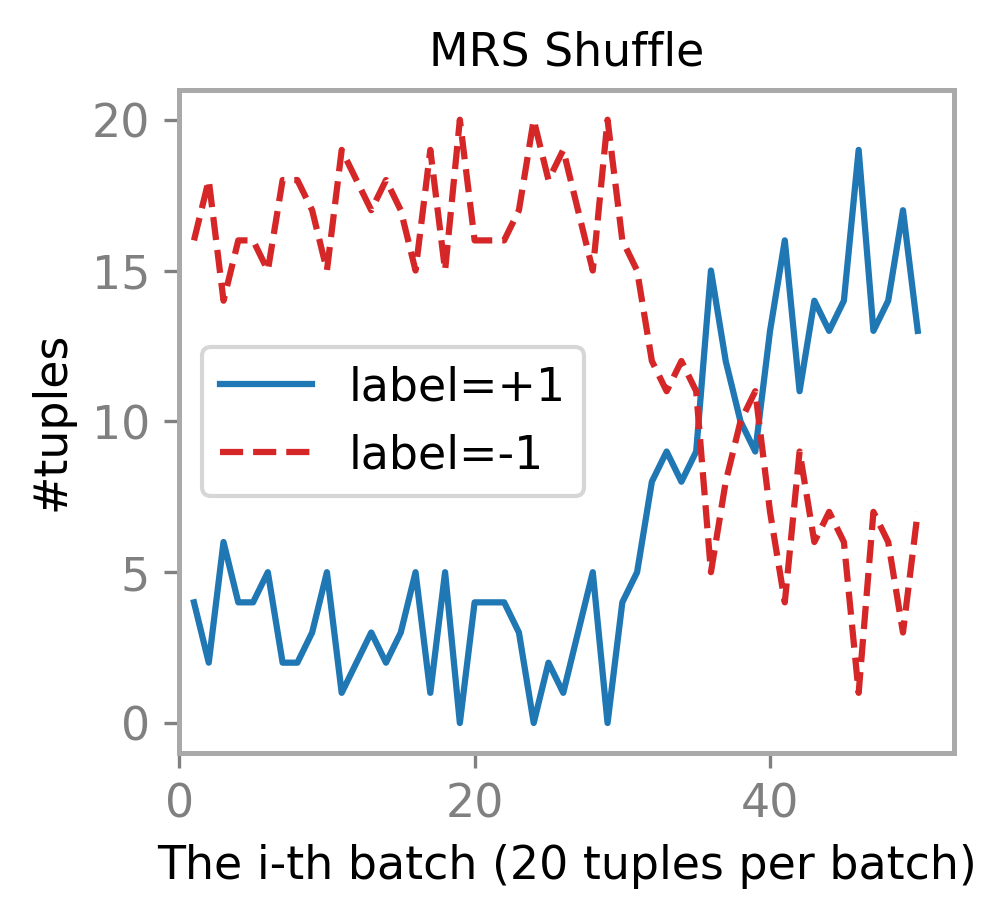 | Multiplexd reservoir sampling - complex implementation |
| **CorgiPile Dual-Layer** | 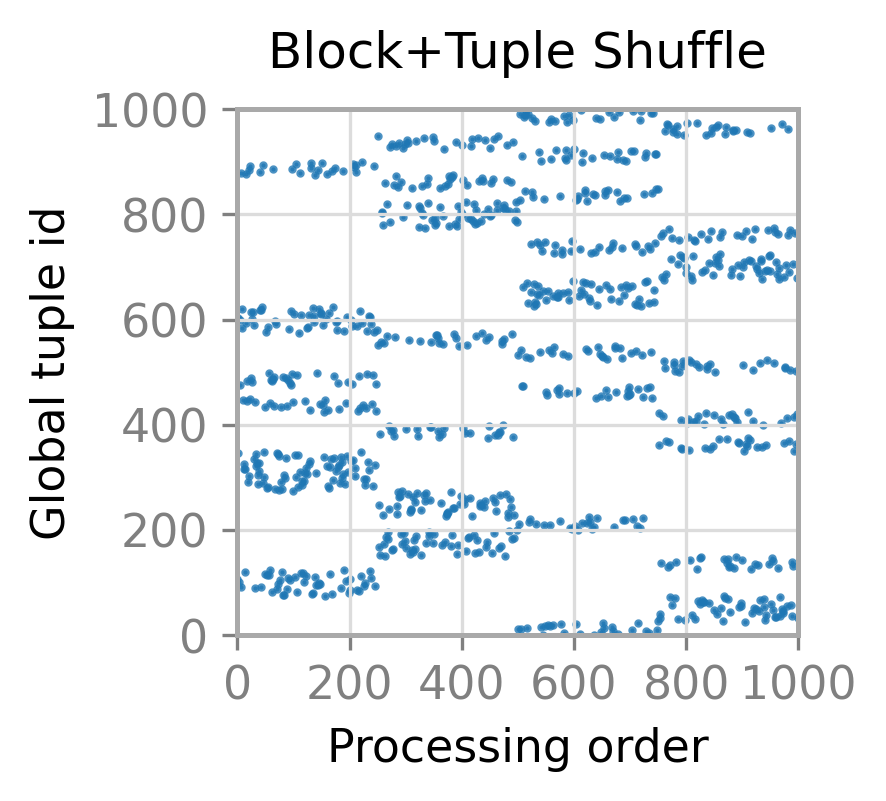       | 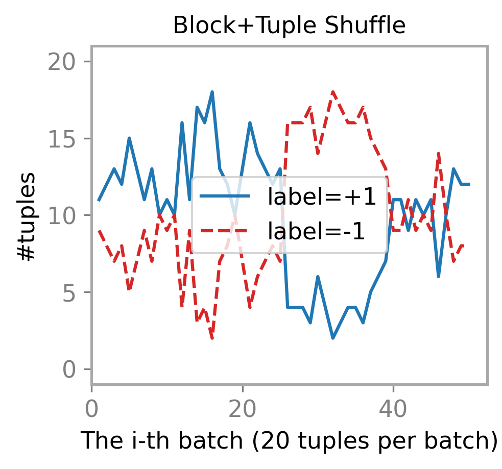 | **Optimal balance of randomness and efficiency** |
| **Fully Random(ideal)** | 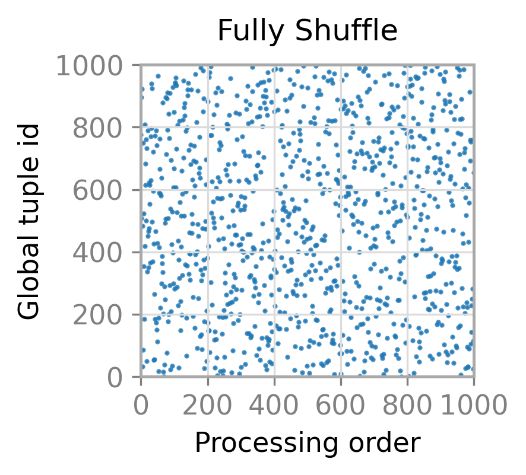           | 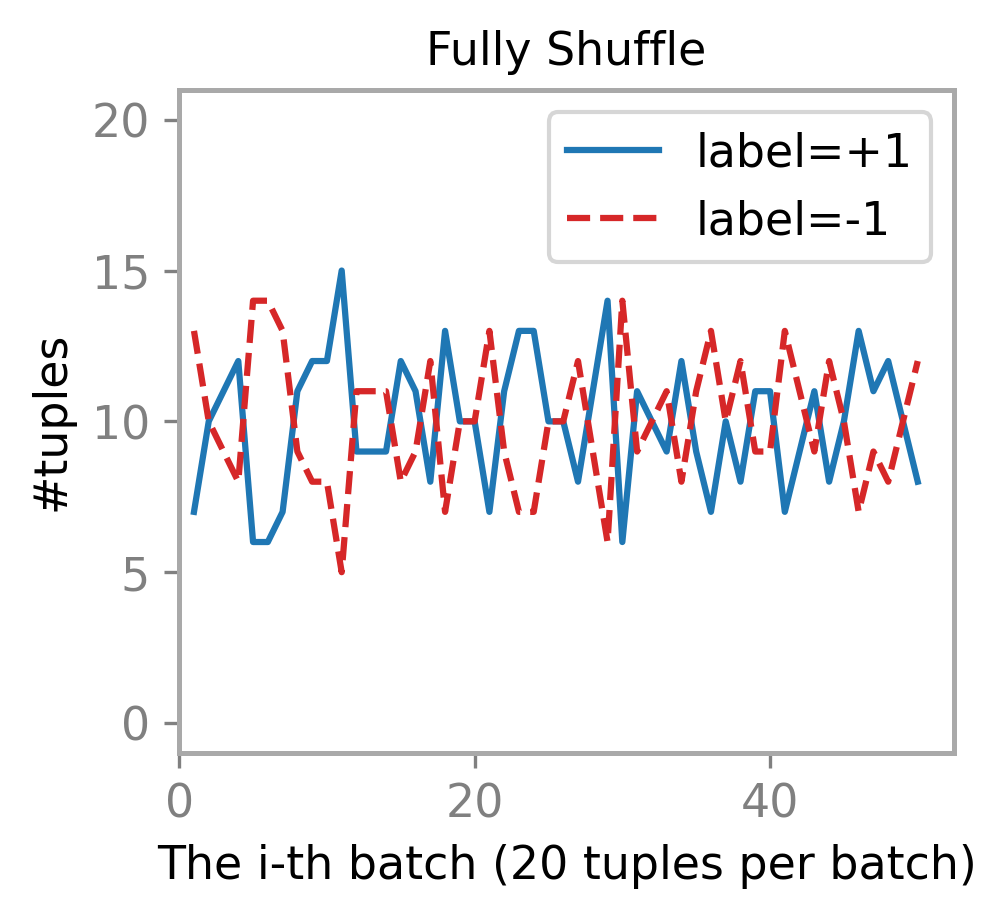 | Complete randomization - memory intensive |

</details>

### **Technical Highlights**

- **Advanced Shuffle Algorithm**: Block+Tuple dual-layer provides optimal randomness vs. efficiency trade-off
- **Production Debugging**: Full sample traceability with `(file_id, inner_index)` tracking
- **Storage Agnostic**: Local files, HDFS, easily extensible to S3/GCS

## Installation

```bash
git clone https://github.com/yourusername/corgipile-dataset-api.git
cd corgipile-dataset-api

# Install dependencies
pip install torch>=1.12.0 numpy>=1.21.0 filelock>=3.7.0

# For HDFS support (optional)
pip install pyarrow>=8.0.0
```

## Quick Start

### **Step 1: Understanding `load_data_fn`**

The key to using CorgiPile is implementing your custom `load_data_fn`. This function defines **how to read your specific data format**:

```python
def my_data_loader(file_path: str, **kwargs):
    """
    Custom data loading function - adapt this to your data format
    
    Args:
        file_path: Path to the data file
        **kwargs: Additional info (file_id, etc.)
        
    Yields:
        tuple: (data, label, trace_info)
               - data: Your actual data (tensor, text, etc.)
               - label: Ground truth label
               - trace_info: (file_id, inner_index) for debugging
    """
    file_id = kwargs.get('file_id', 0)
    
    # Example 1: Text data (TSV format)
    with open(file_path, 'r') as f:
        for inner_idx, line in enumerate(f):
            text, label = line.strip().split('\t')
            yield (text, int(label), (file_id, inner_idx))
    
    # Example 2: JSON data
    # import json
    # with open(file_path, 'r') as f:
    #     for inner_idx, line in enumerate(f):
    #         data = json.loads(line)
    #         yield (data['features'], data['label'], (file_id, inner_idx))
    
    # Example 3: Binary data
    # import pickle
    # with open(file_path, 'rb') as f:
    #     data = pickle.load(f)
    #     for inner_idx, (features, label) in enumerate(data):
    #         yield (features, label, (file_id, inner_idx))
```

### **Step 2: Single-Machine Usage**

Perfect for **single GPU/multi-core training** with large datasets:

```python
import torch
from torch.utils.data import DataLoader
from corgipile_dataset_api import CorgiPileLocalDataset

# Create dataset with your custom loader
dataset = CorgiPileLocalDataset(
    data_dir="/path/to/your/data",      # Directory with your data files
    block_size=100,                     # Samples per block (tune for memory)
    load_data_fn=my_data_loader,        # Your custom loading function
    shuffle=True,                       # Enable dual-layer shuffle
    log_dir="./logs"                    # Track data loading (optional)
)

# Standard PyTorch DataLoader - works seamlessly!
dataloader = DataLoader(
    dataset, 
    batch_size=32, 
    num_workers=4,                      # Multi-threading for performance
    pin_memory=True                     # GPU optimization
)

# Train as usual
for batch_idx, (data, labels, trace_info) in enumerate(dataloader):
    # trace_info contains (file_id, inner_index) for each sample
    # Your training code here
    outputs = model(data)
    loss = criterion(outputs, labels)
    # ...
```

### **Step 3: Multi-Machine Distributed Training**

Scale to **multiple machines** with automatic data partitioning:

```python
from corgipile_dataset_api import CorgiPileDistributedLocalDataset

# Each machine gets different data files automatically
dataset = CorgiPileDistributedLocalDataset(
    data_dir="/shared/training/data",   # Shared storage (NFS, etc.)
    block_size=100,
    load_data_fn=my_data_loader,
    rank=rank,                          # 0, 1, 2, ... (current machine)
    world_size=world_size               # Total number of machines
)

# Same DataLoader code - CorgiPile handles the distribution!
dataloader = DataLoader(dataset, batch_size=32, num_workers=4)
```

### **Step 4: HDFS & Big Data Integration**

Perfect for **Hadoop clusters** and **cloud environments**:

```python
from corgipile_dataset_api import CorgiPileHDFSDataset, CorgiPileDistributedHDFSDataset

# Single-machine HDFS
dataset = CorgiPileHDFSDataset(
    hdfs_root="/user/data/training",
    hdfs_host="namenode-host",
    hdfs_port=9000,
    hdfs_user="hadoop-user",
    block_size=100,
    load_data_fn=my_data_loader,        # Same function works!
    shuffle=True
)

# Multi-machine HDFS (for large clusters)
distributed_dataset = CorgiPileDistributedHDFSDataset(
    hdfs_root="/user/data/training",
    hdfs_host="namenode-host", 
    hdfs_port=9000,
    hdfs_user="hadoop-user",
    block_size=100,
    load_data_fn=my_data_loader,
    rank=rank,                          # Machine rank in cluster
    world_size=world_size,              # Total machines
    shuffle=True
)
```

## API Reference

### CorgiPileLocalDataset

**Parameters:**
- `data_dir` (str): Root directory containing data files
- `block_size` (int): Number of samples per block
- `load_data_fn` (Callable): Function to load data from file path
- `shuffle` (bool): Enable dual-layer shuffle. Default: True
- `log_dir` (Optional[str]): Directory for logging. If None, no logging
- `file_filter_fn` (Optional[Callable]): Function to filter valid files

### CorgiPileDistributedLocalDataset

**Additional Parameters:**
- `rank` (int): Current machine rank. Default: 0
- `world_size` (int): Total number of machines. Default: 1

### CorgiPileHDFSDataset

**Additional Parameters:**
- `hdfs_root` (str): HDFS root directory path
- `hdfs_host` (str): HDFS namenode hostname
- `hdfs_port` (int): HDFS namenode port
- `hdfs_user` (str): HDFS username

### CorgiPileDistributedHDFSDataset

**Additional Parameters:**
- `hdfs_root` (str): HDFS root directory path
- `hdfs_host` (str): HDFS namenode hostname  
- `hdfs_port` (int): HDFS namenode port
- `hdfs_user` (str): HDFS username
- `rank` (int): Current machine rank. Default: 0
- `world_size` (int): Total number of machines. Default: 1

## Architecture

### Block-Level Processing
- Memory-efficient streaming of large datasets
- Configurable block sizes for optimal performance
- Better CPU cache utilization through locality

### Dual-Layer Shuffle Algorithm
1. **Inter-block shuffle**: Randomize the order of data blocks
2. **Intra-block shuffle**: Shuffle samples within each block
3. **Result**: Superior training randomness with controlled memory usage

### Sample Traceability
Every sample includes source information `(file_id, inner_index)` enabling:
- Debugging data loading issues
- Reproducible training
- Data lineage tracking

## Performance Tips

1. **Choose appropriate block_size**: Balance memory usage and shuffle quality
   - Smaller blocks: Better shuffle, more memory overhead
   - Larger blocks: Better performance, less randomness
2. **Worker Configuration**: Set `num_workers > 0` in DataLoader for parallel processing
3. **HDFS Optimization**: Use `multiprocessing_context='spawn'` for HDFS datasets

## **Complete Examples**

### **Ready-to-Run Examples**

| Example | Description | Use Case | Code Link |
|---------|-------------|----------|-----------|
| **CIFAR-10 Demo** | Complete training pipeline with CIFAR-10 dataset | Learning CorgiPile basics | [`examples/cifar_example.py`](examples/cifar_example.py) |
| **Distributed Training** | Multi-machine setup with automatic data partitioning | Production distributed training | [`examples/distributed_example.py`](examples/distributed_example.py) |

### **Running the Examples**

#### **1. CIFAR-10 Quick Start**
```bash
# Single-machine local training
python examples/cifar_example.py --mode local

# Single-machine with HDFS
python examples/cifar_example.py --mode hdfs --hdfs_host your-namenode
```

#### **2. Distributed Training (Multiple Machines)**
```bash
# On Machine 0 (rank=0)
python examples/distributed_example.py --mode local --rank 0 --world_size 4

# On Machine 1 (rank=1)  
python examples/distributed_example.py --mode local --rank 1 --world_size 4

# On Machine 2 (rank=2)
python examples/distributed_example.py --mode local --rank 2 --world_size 4

# On Machine 3 (rank=3)
python examples/distributed_example.py --mode local --rank 3 --world_size 4
```

#### **3. HDFS Distributed Training**
```bash
# Each machine in your cluster
python examples/distributed_example.py --mode hdfs --rank $RANK --world_size $WORLD_SIZE \
    --hdfs_host namenode-host --hdfs_port 9000 --hdfs_user hadoop-user
```

